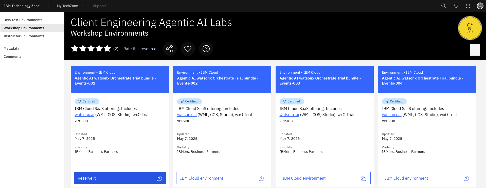

# Lab 0 - Environment setup

!!! info
    All participants must follow the pre-requisite steps to reserve TechZone watsonx Orchestrate environment.

For this bootcamp, we have created the [Agentic AI Bootcamp TechZone bundle](https://ibm.biz/tz-agenticAI-camp){:target="_blank"}, which has all the components needed for the hands-on labs, including:

- watsonx.ai
- Cloud Object Storage (COS) & watsonx.ai Runtime (formerly WML)
- watsonx Orchestrate
- IBM CodeEngine
- watsonx.governance (for the demo)

**Reserve any of the following instance to get started.**

!!! note "Important Note!"

    After the Techzone reservation is complete, you will receive an email about it from IBM Techzone. After this, you will receive another email from IBM Cloud inviting you to join a cloud account. Please note, you DO NOT have to create the Cloud account. Techzone reservation will create the account and you DO NOT have to put your credit card anywhere for this.
    Incase you don't have access to the TechZone you most likely don't have and IBM ID. Create an IBM ID by following the instructions here: [Create your IBMid](environment-setup-lab/create-ibmid.md)

## Next step

<!-- 1. [Access your class instance](access-env.md)
1. [Setup your first project](create-project.md)
1. [Create your API key](api_key_project_id_setup.md) -->
- [Setup watsonx Orchestrate Agent Development Kit (ADK)](environment-setup-lab/wxo-client-setup.md)
 