# Lab 0 - Environment setup: Create your API key

## Prerequisite Steps

1. Log in to your **Watsonx AI** account. Once logged in, you will land on the homepage.  
   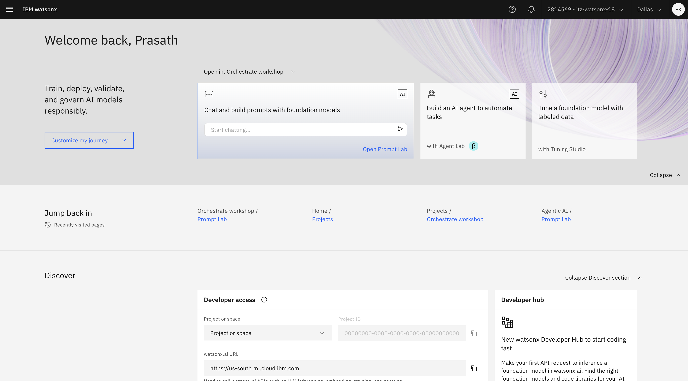  

2. Click on the **"+"** icon to create a new project.  
   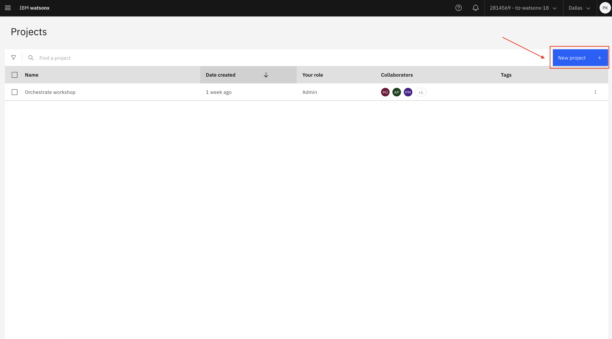  

3. Enter a name for your project.  
4. Select a storage option from the available choices.  
5. Click **"Create"** to finalize the setup.  
   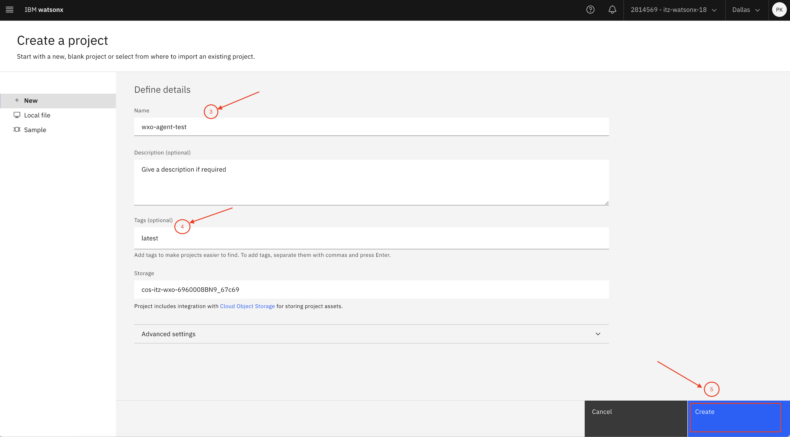  

    !!! success "Well done!"
        Your new project is now ready to use! 

6. Click on the **hamburger menu (☰)** in the top-left corner and select **"Access (IAM)"**.  
   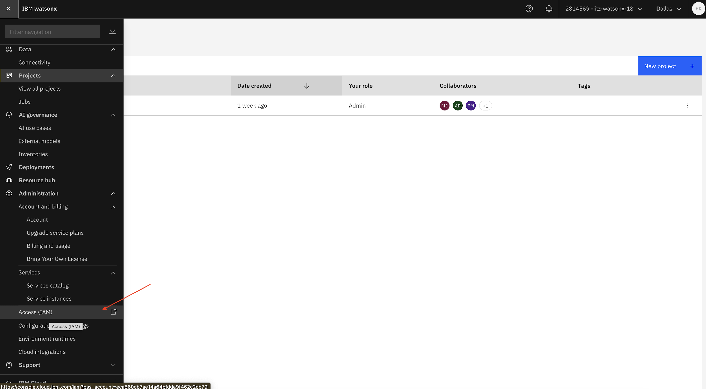  

7. In the left-hand menu, click on **"API Keys"**.  
   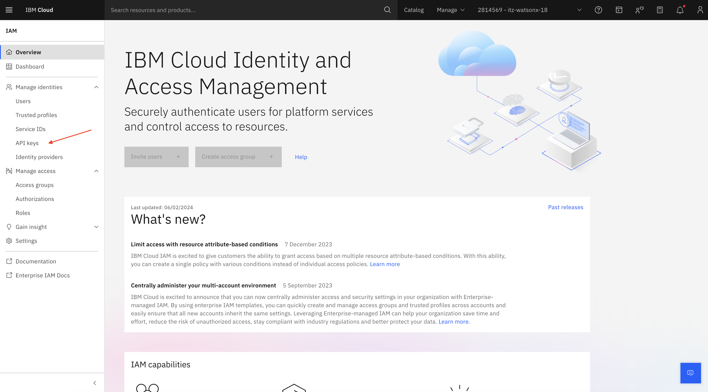  

8. Click **"Create"** to generate a new API key.  
   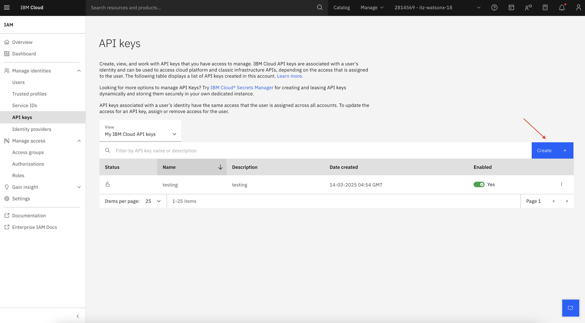  

9. Enter a name for your API key and click **"Create"**.  
   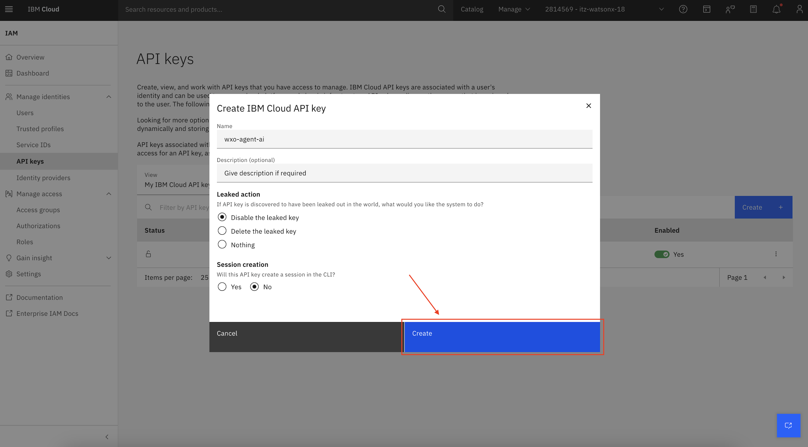  

10. **Copy your API key** and save it in a secure location. You will need it in later steps.  
    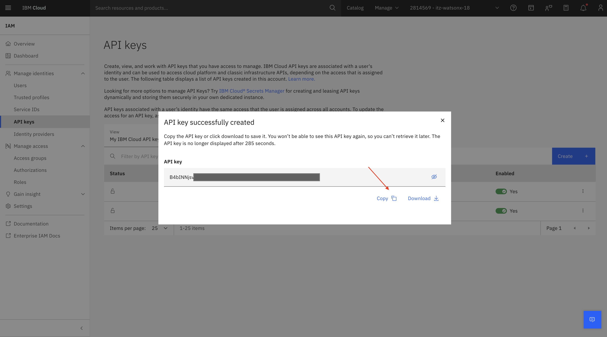  

## Steps to Access Project ID

1. Click on the hamburger menu (three horizontal lines) located at the top-left corner of the screen, You will see view all project options under Project section.
   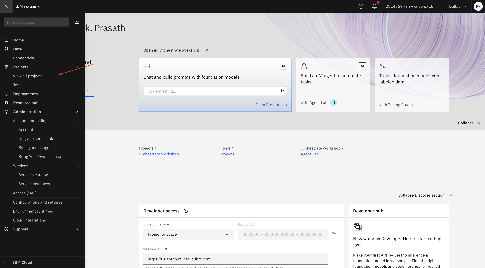

2. Now you will be redirected to list of Projects, find and click on the project you want to work with.
   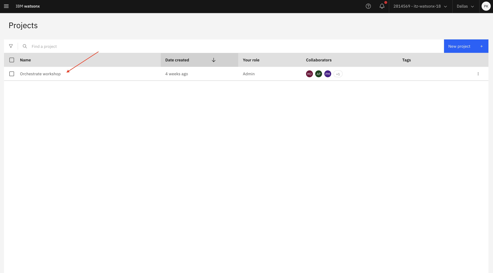  

3. Once inside the project view, click on the "Manage Options" button.

4. After clicking "Manage Options", the Project ID will be displayed copy Project ID for further use.
   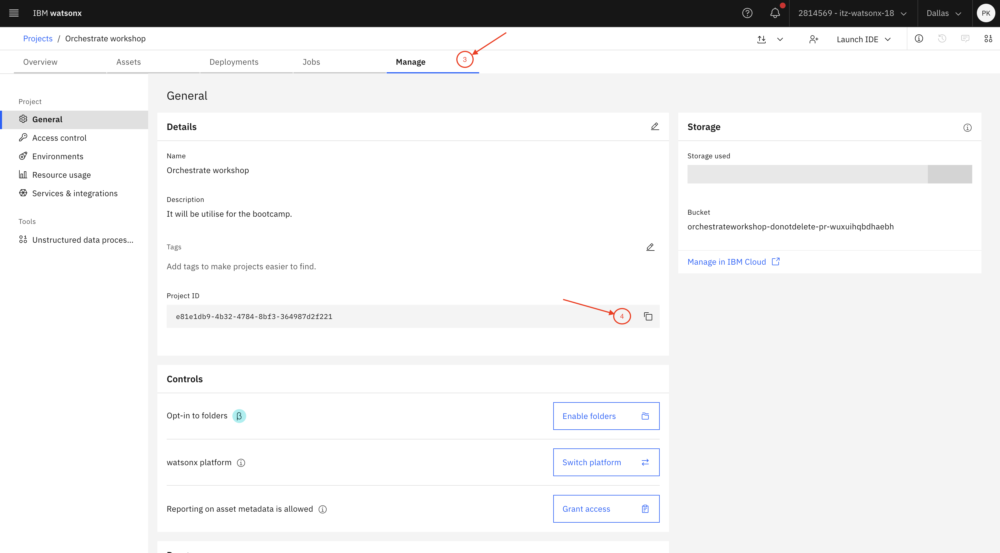

!!! success "Well done!"
    Now that we have created both the Project ID and the API Key, we will proceed with the creation of our agents.
