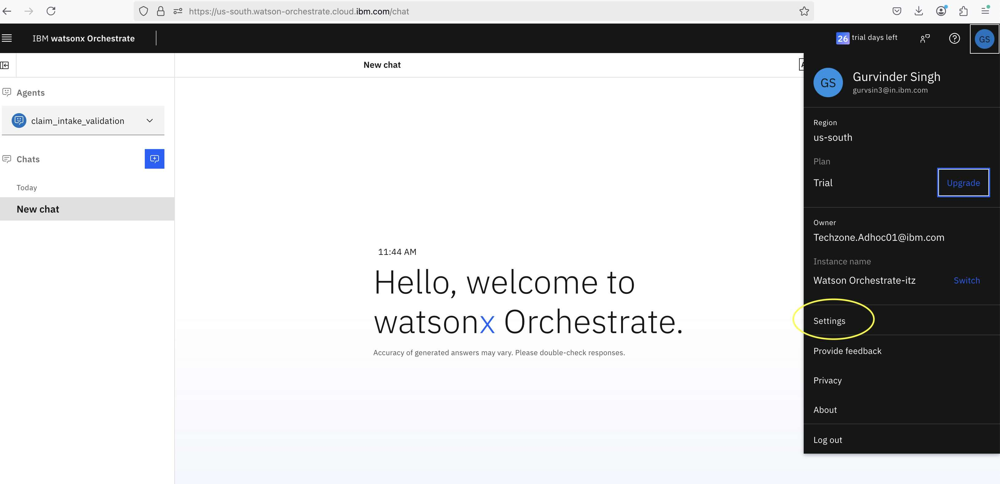
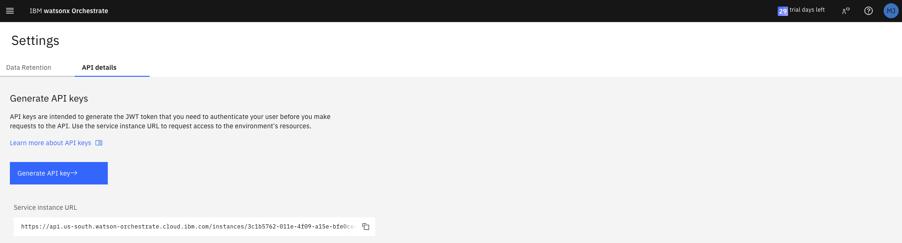
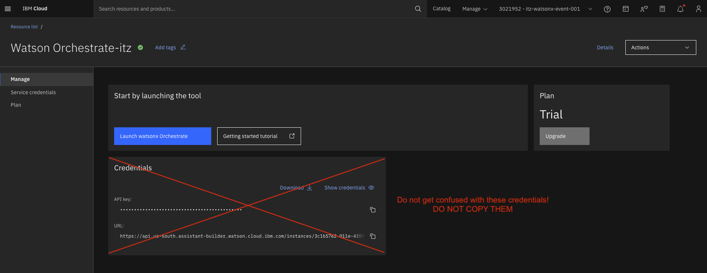

# Lab 0 - Environment setup: running wxo-client adk locally

!!! note

    Follow these instructions for running wxo-client ADK locally in order to successfully complete the Agentic AI pro-code bootcamp labs.

## Installing the ADK

Install the IBM watsonx Orchestrate ADK on your computer.
​
## Installation prerequisites

- Install the required software to enable the ADK installation:
    - Python: The programming language that the ADK is written in. The ADK requires at least Python 3.12, and the latest compatible version is Python 3.13. For more information, see Python.
    - Pip: Pip is Python’s package manager. In some operating systems, it’s included with Python’s installation. For more information, see Pip.

- Optional: Create a virtual environment with venv to install the ADK. For more information, see venv --- Creation of virtual environments.


## Installing the ADK

- Install the ADK with pip.

    ```
    pip install ibm-watsonx-orchestrate
    ```

- Test the installation:

    ```
    orchestrate --help

    ```

!!! note

    Use the **--help** argument to get information about each command and its arguments in the ADK CLI.

## Enabling the Bootcamp Environment

- You would need following properties to activate "bootcamp" environment:

    - IBM Cloud API Key
    - WXO_INSTANCE_URL (Make sure you copy it from your wxO instance UI under the settings.)

### Steps to get your wxO instance URL and IBM Cloud API Key

- After login to <https://cloud.ibm.com>, go to resources page by clicking on the left side menu
- Under the **AI/Machine Learning** click on your Watsonx Orchestrate Instance.
- Now, click on **Launch Watsonx Orchestrate** button in blue color.
- This would open wxO instance UI on a new tab.
- On this page, click on your profile image at the top right and then click on **Settings**



- On the **Settings** page, click on the **API Details** tab.
- Copy the Service instance URL, which you need to provide in the above env add command.
- Click on **Generate API key** and create a new API Key.  You would need this key to activate the **bootcamp** env.



---


 - Run below commands to activate "bootcamp" environment and provide your IBM Cloud API Key once asked for the input.

```
orchestrate env add --name bootcamp --url <REPLACE_WITH_WXO_INSTANCE_URL> -t ibm_iam
orchestrate env activate bootcamp --apikey <YOUR_API_KEY>

```


---

!!! warning "Do not get confused with these credentials and DO NOT COPY THEM!"

    
