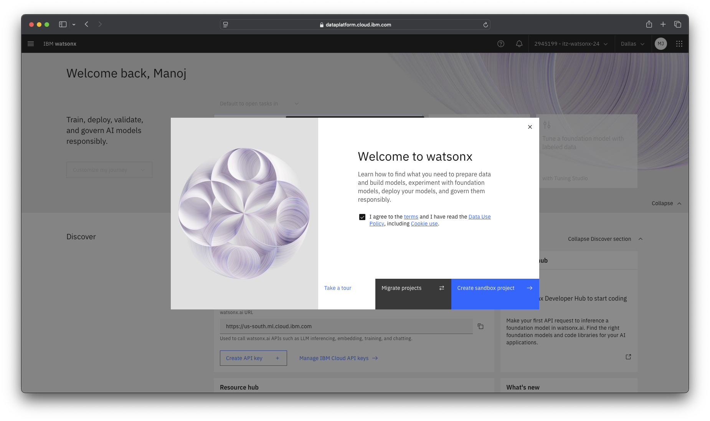
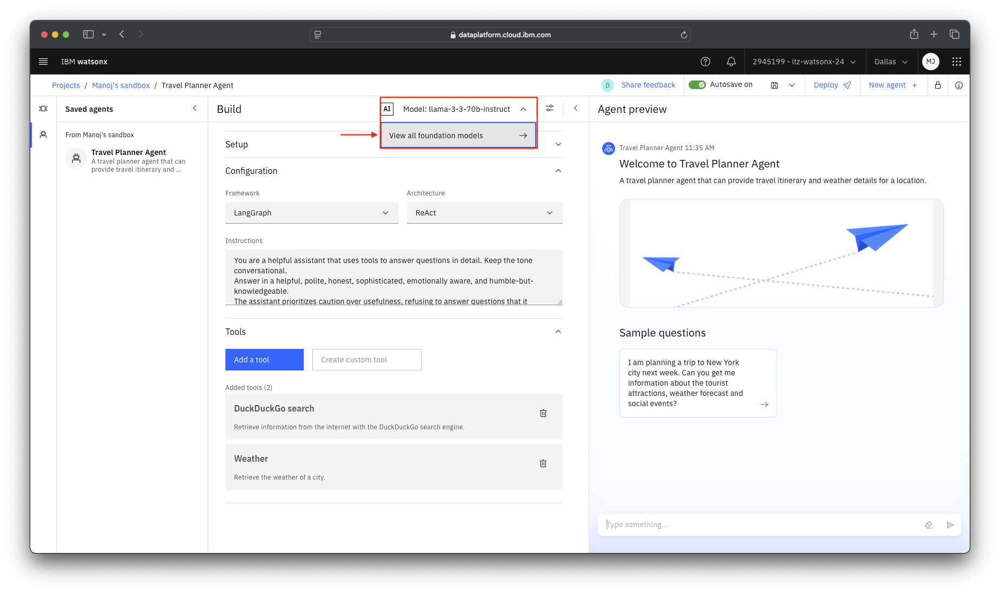
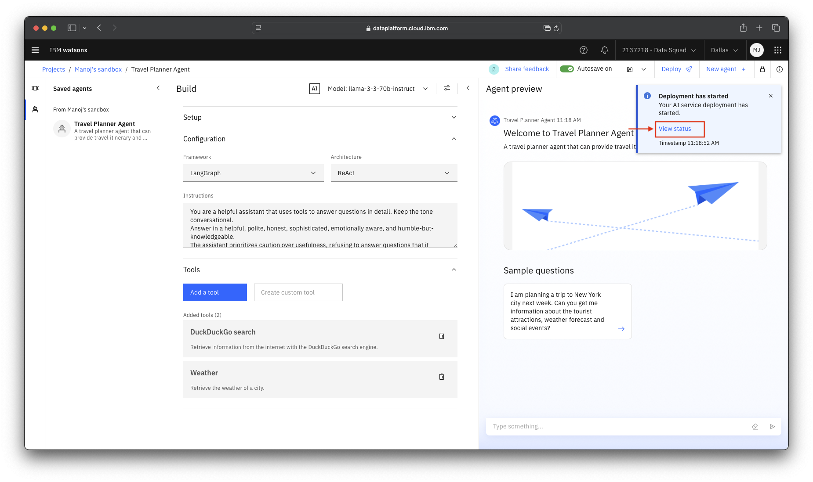
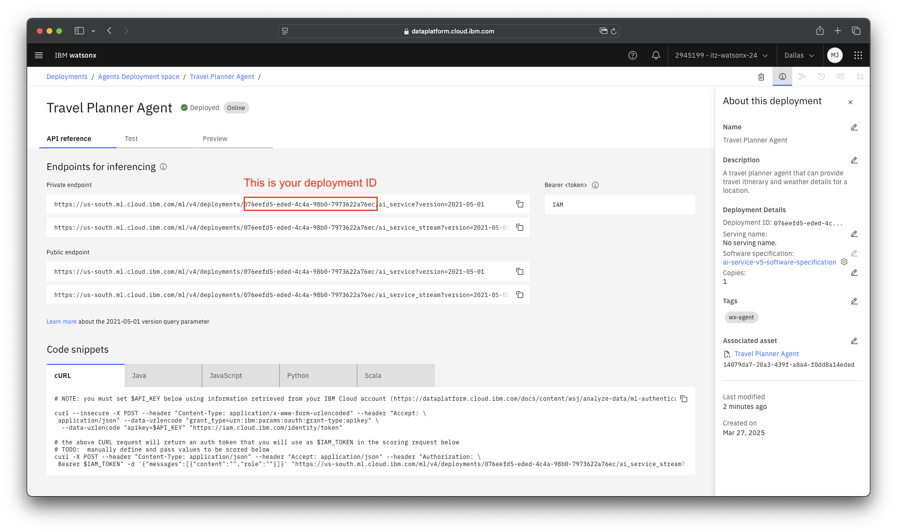
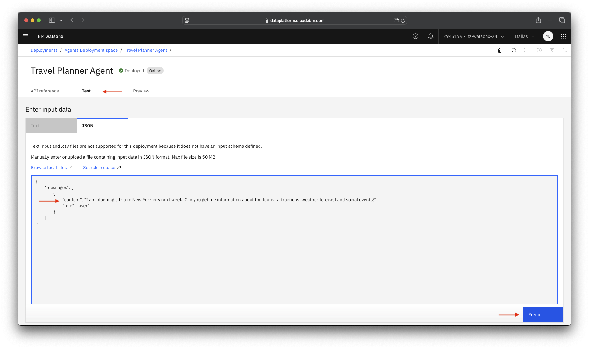

# Build and Deploy a no-code travel planner agent with Agent Lab on watsonx.ai

!!! warning "Draft version"
    
    Work in progress!

!!! info "Agentic AI Framework Details"

    - **Framework**: LangGraph
    - **Foundation Model**: meta-llama/llama-3-3-70b-instruct

## Use case

### Travel planner agent

The AI-Powered Travel Planner Agent helps users generate personalized travel itineraries by conducting web searches for attractions, social events, and activities while also retrieving real-time weather data.

Key Features:

- Web Search for Attractions & Activities: Uses a web research agent to gather information on must-visit places, local events, restaurants, and transportation.
- Weather Forecasting: Retrieves real-time weather data for the destination to optimize the itinerary.
- Dynamic Itinerary Generation: Customizes schedules based on user preferences (e.g., adventure, culture, relaxation) and weather conditions.
- Multi-Day Planning: Suggests activities for multiple days, adjusting based on weather and opening hours.

## Steps

### Get familiarized with Agent Lab on watsonx.ai

1. Login to <https://dataplatform.cloud.ibm.com/> to access the watsonx.ai platform. And create a sandbox project to get started.

    

1. Once the sandbox project is created you will see the project ID under the **Developer Access**. Save it in a notepad as it will be useful in next labs. 
    
    

    !!! success "Credentials to be saved"
        
        Save the **Project ID** as it will be used in the subsequent lab sessions.

1. Click on the **Build an AI agent to automate tasks** to open the Agent Lab.

    

1. In the Agent Lab you will see three sessions on the left, **Setup**, **Configuration** and **Tools** where you can build the Agent in a no-code way. And on the right side you will see the **Agent Preview**. Try asking any question such as:
    ```
    How is IBM Stock performing?
    ```

    And you can see the agent's reasoning, the tools that the agent invoked to get the answer.
    
      

### Build Travel Planner Agent

1. Next, lets create the travel planner agent.
    - Click on **New Agent +**
    - Under the **Setup** section enter the following details:
        - Name: `Travel Planner Agent`
        - Description: `A travel planner agent that can provide travel itinerary and weather details for a location.`
        - You can choose the Icon and Placeholder image as per your likings.
        - Quick start questions: `I am planning a trip to New York city next week. Can you get me information about the tourist attractions, weather forecast and social events?` Click on the **+** button to add it.

    

1. Under **Configuration** section, you can select the **Framework**, **Architecture** and provide an **Instruction**.
    - Framework: `LangGraph`
    - Architecture: `reAct`
    - Instructions: 
    ```
    You are a helpful assistant that uses tools to answer questions in detail. Keep the tone conversational.
    Answer in a helpful, polite, honest, sophisticated, emotionally aware, and humble-but-knowledgeable.
    The assistant prioritizes caution over usefulness, refusing to answer questions that it considers unsafe, immoral, unethical or dangerous.
    Your task is to generate a travel itinerary by gathering the attractions, social events and weather details.
    You can use markdown to format your responses in a structured manner.
    ```

      

1. Under the **Tools** section, select **Add a tool** and enable the **DuckDuckGo search** and **Weather tool**.

      

1. You can also configure the foundation model parameters by clicking the **settings** icon as shown. We'll leave it default for this agent.

      

1. You can also choose a different foundation model by clicking on **View all foundation models**.

      

1. You will be presented with the model catelog.  We'll use the `llama-3-3-70b-instruct` to build this agent.

      

1. Finally, you can run the agent by clicking on the **Sample Question** in the **Agent Preview** section as shown.
    
      

1. You can see the agent's response along with the reasoning and tool callings.
      
      

### Save the Agent

1. Click on the **Save** button on top right, and select **save as**.
      

1. You will see three options to save the agent:
    1. **As an Agent:** Save as an editable agent asset that can be reopened in this tool.
    1. **As a standard notebook:** Save the current agent as a Jupyter notebook.
    1. **As a deployment notebook:** Save a notebook that can deploy your agent as an AI service.
    Click on the **Agent** and save it.

      

1. You can click on the **user icon** and view/edit the agents from here.
    
      

### Deploy the agent as an AI Service

1. Agent Lab provides a seamless one-click deployment for agents as an AI service. Click on the **Deploy** button.
      

1. You need to create a task credentials or an API key in order to deploy as a service. Click on the banner to create an API key.
    
      

1. You will be redirected to the user page where you can create an API key. Once created navigate back to the previous page.
    
      

1. Click on **Reload**.

      

1. Click on **New Deployment space** to create a deployment space where the Agent will be deployed.
    
      

1. Enter the details and create the deployment space.
    
      

1. Click on **Reload** and you will see the deployment space available. Click on deploy.
    
      

1. You will see a notification that says: **Deployment has started**. Click on **View status** to go to the deployment space.
    
      

1. Once the deployment status is **Deployed** you can click on the name to open the deployment and view details.
    
      

1. You will see three tabs, **API reference**, **Test**, **Preview**. You can see the production ready public and private endpoints for your deployed agent. You can also see the deployment ID, save it in a notepad as it will be used lated to import this agent in watsonx Orchestrate.
    
      
    
    !!! success "Credentials to be saved"
        
        Save the **Deployment ID** as it will be used in the subsequent lab sessions.

1. Click on **Test** tab and you can test the service endpoint. Enter the following as a payload and click on **Predict**.
    - role: `user`
    - content: `I am planning a trip to New York city next week. Can you get me information about the tourist attractions, weather forecast and social events?`

    

1. You will see the same results from the agent as a response from the service endpoint.

    

>Next steps: You will learn how to import this agent in watsonx Orchestrate in Lab 5.