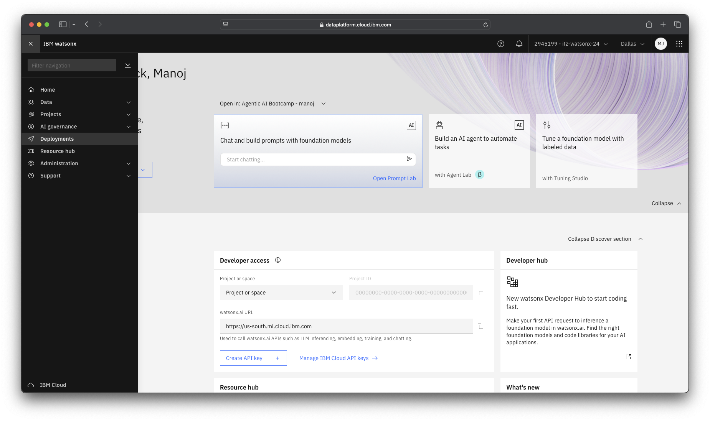
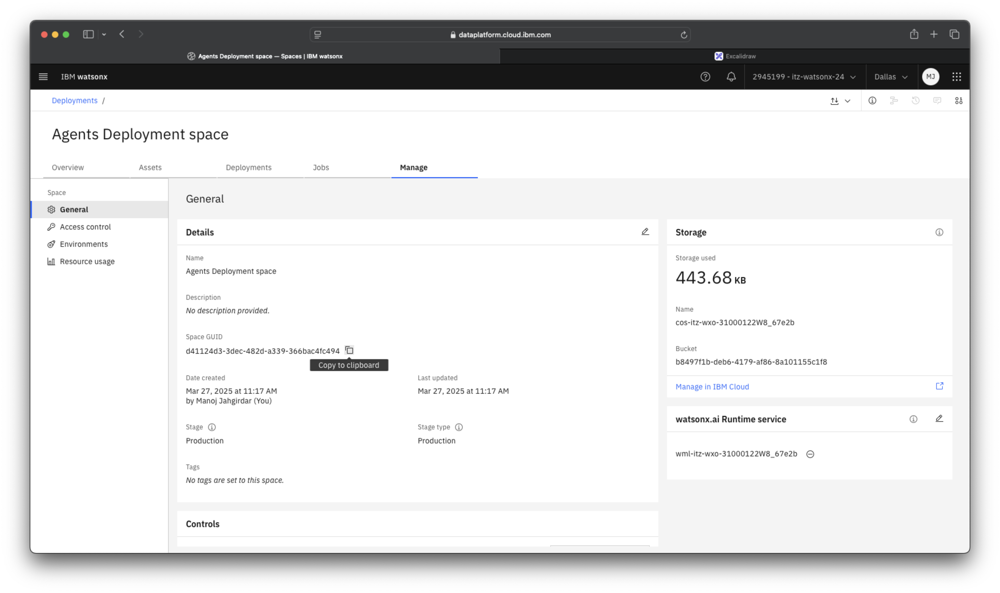
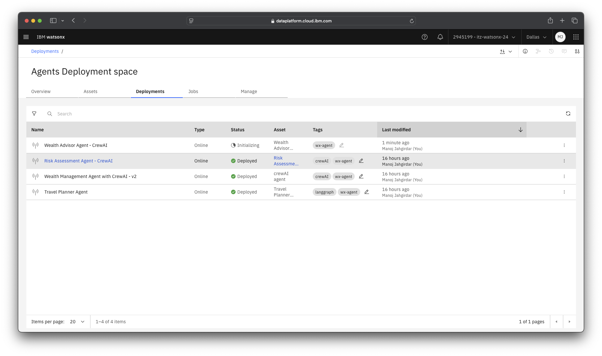
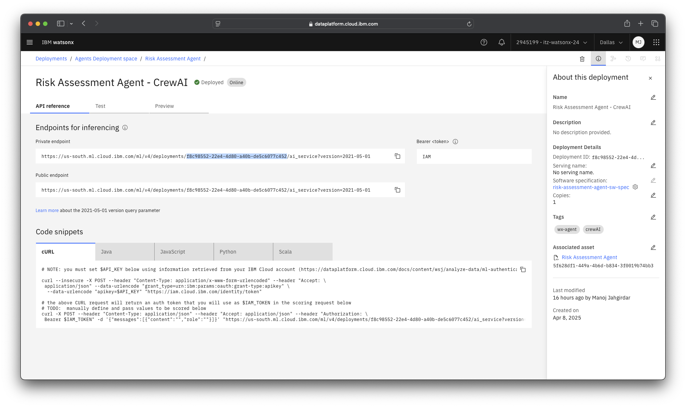
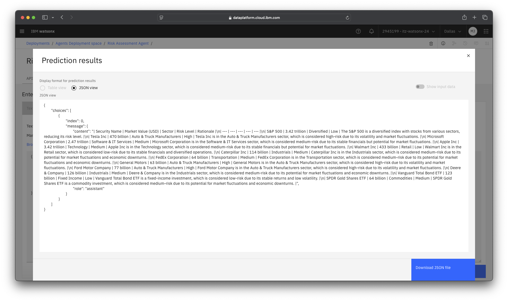

# Build and Deploy a risk assessment and wealth advisor agents with watsonx

## Use case

### Risk assessment agent

!!! info "Agentic AI Framework Details"

    - **Framework**: CrewAI
    - **Foundation Model**: meta-llama/llama-3-3-70b-instruct

The Portfolio Risk Assessment Agent supports financial advisors by evaluating investment portfolios for potential risk exposures. It reviews each asset in the portfolio based on factors like market value concentration, sector distribution, volatility, and overall diversification, delivering a detailed and actionable risk profile.

Key Features:

- Risk Evaluation per Asset: Assesses each security in the portfolio and assigns a Risk Level (High, Medium, Low) based on exposure and volatility.
- Diversification & Sector Analysis: Identifies sector over concentration and diversification gaps that may impact portfolio stability.
- Markdown Risk Report: Generates a clean, structured Markdown table summarizing each asset’s name, value, sector, risk level, and rationale for easy review and reporting.

### Wealth advisor agent

!!! info "Agentic AI Framework Details"

    - **Framework**: CrewAI
    - **Foundation Model**: meta-llama/llama-3-3-70b-instruct

The Portfolio Insight & Recommendation Agent assists financial advisors by thoroughly analyzing client investment portfolios to provide actionable insights and recommendations. It systematically evaluates the client's investment strategy, asset allocation, risk impact, and offers practical steps to mitigate identified risks, ensuring a comprehensive understanding and optimized portfolio management.

Key Features:

Investment Strategy Analysis: Summarizes the client’s investment approach to capture strategic objectives and underlying methodology clearly.

Asset Allocation Recommendations: Offers tailored suggestions for asset allocation based on current market conditions and individual risk appetite, presented in an easy-to-review markdown table.

Risk Impact & Opportunity Assessment: Identifies and categorizes portfolio risks (Low, Medium, High), highlighting key investment opportunities arising from these risk factors.

Near-Term Actionable Recommendations: Provides explicit, practical steps for risk mitigation, including hedging strategies, asset reallocation, and enhanced diversification measures.

Comprehensive Markdown Report: Generates a structured report clearly divided into sections covering investment strategy, asset allocation, risk assessment, and recommendations, prominently noting that it is AI-generated and recommending consultation with a licensed financial advisor for personalized advice.

## Steps

### Step 1: Clone the GitHub repo

1. We have curated the CrewAI multi-agent as part of this lab, get started by cloning the repo:

    ```
    git clone --no-tags --depth 1 --single-branch --filter=tree:0 --sparse https://github.com/IBM/EEL-agentic-ai-bootcamp.git
    cd EEL-agentic-ai-bootcamp/
    git sparse-checkout add labs/lab3/risk-assessment-agent
    git sparse-checkout add labs/lab3/wealth-advisor-agent
    ```

1. This CrewAI code is developed using the quick start [template for LLM apps building using CrewAI framework](https://www.ibm.com/watsonx/developer/agents/quickstart).

!!! info "Reference Material"
    You can learn more about the different starter kits made available by watsonx developer hub here: <https://www.ibm.com/watsonx/developer/agents/quickstart>

### Step 2: Pre-requisites for Risk assessment agent

1. Once you have cloned the repo goto the `risk-assessment-agent` directory:

    ```
    cd labs/lab2/risk-assessment-agent
    ```

1. Install poetry package manager (Recommended).

    ```
    pip install pipx
    pipx install --python 3.11 poetry
    ```

1. Running the below commands will install the repository in a separate virtual environment  

    ```sh
    poetry install
    ```

1. Activate the virtual environment

    ```
    source $(poetry -q env use 3.11 && poetry env info --path)/bin/activate
    ```

1. Adding working directory to PYTHONPATH is necessary for the next steps. In your terminal execute:  

    ```
    export PYTHONPATH=$(pwd):${PYTHONPATH}
    ```

1. In `config.toml` enter the following details:

    ```
    watsonx_apikey = " " # watsonx api key
    space_id = " " # space id
    project_id = " " # project id
    tavily_api_key = " " # tavily api key
    ```

    !!! success "Credentials"
        
        `watsonx_apikey`, `space_id` and `project_id` has been generated in Lab 1. Please use the same credentials. 
        `tavily_api_key` you can create a free Tavily API key on https://tavily.com/ or ask the instructor to provide the API key.

### Step 3: Run the agent locally

1. Run the following command to test the agent locally.

    ```
    python examples/execute_ai_service_locally.py
    ```

1. Enter the input as follows:

    ```
    Can you analyze risk for John Doe's portfolio
    ```
    
1. You wil see the Agent's reply.

### Step 4: Deploy the agent to watsonx.ai

1. Goto the watsonx.ai platform, click on the hamburger menu in watsonx.ai platform and select **Deployments**.

    

1. Create a new deployment space.
    
      

1. Select the deployment space.

    

1. Goto **Manage** and you will see the **Space GUID**. Copy that as it will be used later in the lab.

    

    !!! success "Credentials to be saved"
        
        Save the **Space GUID** as it will be used in the subsequent lab sessions.

1. You can now deploy the agent on watsonx.ai runtime by running the following command in terminal.

    ```
    python scripts/deploy.py
    ```

1. And you will see the deployment status in the **Deployments* tab*.

    

1. Once the deployment status is **Deployed** you can click on **Risk Assessment Agent - CrewAI** to open the deployment and view details. You will see three tabs, **API reference**, **Test**, **Preview**. You can see the production ready public and private endpoints for your deployed agent. You can also see the deployment ID, save it in a notepad as it will be used lated to import this agent in watsonx Orchestrate.

    

    !!! success "Credentials to be saved"
        
        Save the **Deployment ID** as it will be used in the subsequent lab sessions.

1. Click on **Test** tab and you can test the service endpoint. Enter the following as a payload and click on **Predict**.
    - role: `user`
    - content: `Can you analyze risk for John Doe's portfolio`

    

1. You will see the same results from the agent as a response from the service endpoint.

    

>Next steps: You will learn how to import this agent in watsonx Orchestrate in the next lab.

### Step 5: Build and Deploy the Wealth advisor agent

Now that risk assessment agent is ready, you can follow the same steps to deploy and test the wealth advisor agent.

1. Goto `wealth-advisor-agent` directory:

    ```
    cd ../wealth-advisor-agent
    ```

1. You already have poetry by now, running the below commands will install the repository in a separate virtual environment  

    ```sh
    poetry install
    ```

1. Activate the virtual environment

    ```
    source $(poetry -q env use 3.11 && poetry env info --path)/bin/activate
    ```

1. Adding working directory to PYTHONPATH is necessary for the next steps. In your terminal execute:  

    ```
    export PYTHONPATH=$(pwd):${PYTHONPATH}
    ```

1. You have already created the `config.toml`. Copy the `config.toml` to the `wealth-advisor-agent` directory to use the same credentials.

    ```
    cp ../risk-assessment-agent/config.toml .
    ```

1. Now you can test the wealth advisor locally by running the following command:

    ```
    python examples/execute_ai_service_locally.py
    ```

1. Enter the input as follows:

    ```
    Can you give me an advice on John Doe's portfolio
    ```
  
1. You wil see the Agent's reply.

1. Now that the agent is tested locally, you can deploy the agent on watsonx.ai runtime.

    ```
    python scripts/deploy.py
    ```

1. Once the deployment status is **Deployed** you can click on **Wealth Advisor Agent - CrewAI** to open the deployment and view details. You will see three tabs, **API reference**, **Test**, **Preview**. You can see the production ready public and private endpoints for your deployed agent. You can also see the deployment ID, save it in a notepad as it will be used lated to import this agent in watsonx Orchestrate.

    

    !!! success "Credentials to be saved"
        
        Save the **Deployment ID** as it will be used in the subsequent lab sessions.

1. Click on **Test** tab and you can test the service endpoint. Enter the following as a payload and click on **Predict**.
    - role: `user`
    - content: `Can you give me an advice on John Doe's portfolio`

    

!!! info "AskHR using Agentic AI"

    **[Build AskHR step by step](https://github.ibm.com/skol/agentic-ai-client-bootcamp/tree/main/usecases/ask-hr)**

    - In this lab, we will see how the out-of-the-box prebuilt skills in watsonx Orchestrate can connect to HR management tools such as Workday, SuccessFactors, etc., or create custom skills to connect to any such systems easily.

> Next steps: You will learn how to import this agent in watsonx Orchestrate in the next lab.
