# Lab guide for vehicle maintenance use case

## Overview

This LAB is written to simulate a vehicle troubleshooting scenario. Here the scenario is that a vehicle that has Internet of Things (IoT) has broken down and the user is seeking for help. The car has some weird noise and the user asks the chatbot why is there a noise what does it mean? and the AI Agent goes through reasoning to find out what went wrong and provide an analysis report and find nearest service center.

## Pre-requisites

- Make sure you've already setup the environment:
- [Lab 0 - Environment setup: Pre-requisites](../../labs/environment-setup-lab/)
- [ADK Installation](https://developer.watson-orchestrate.ibm.com/getting_started/installing)
- [Download files](https://ibm.box.com/s/a0jk8tep96yk2decqts4kakeqbho5ejd)

!!! success "Password to download the files"
    Instructors will provide you the password to download the files.

## Reference Architecture

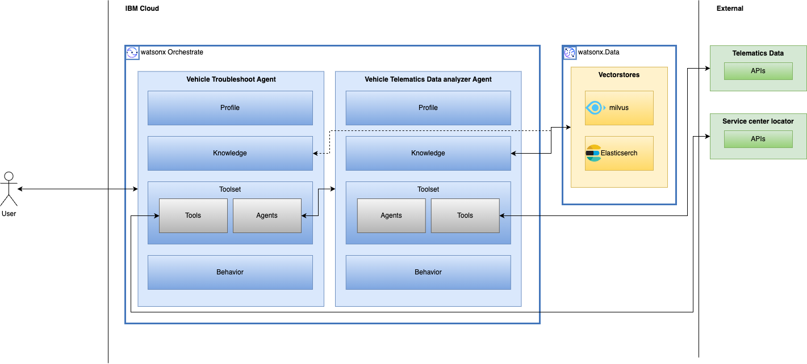

## Key Components

- Telematics data analyzer agent (External Agent) – Get the car telematics data and analyze it to provide a natural language summary
- Get Telematics data (Tool) – Get the telematics data of a car. (simulation)
- Get nearest service center (Tool) – Get the nearest service center. (takes lat & lon and gives results)
- Troubleshoot agent (Native wxO Agent) – A supervisor agent that orchestrate between the following:
    1. Knowledge (RAG):
        1. DTC code list.pdf
        1. Car user manual.pdf
    2. Toolset:
        1. Agents:
            1. Telematics data analyzer agent
        1. Tools:
            1. Get nearest service center

## Steps

### 1. Deploy the toolsets

- To get started with the Agent Builder on watsonx Orchestrate UI, you will have to deploy the toolsets first.
- From the root of the downloaded files, run the following commands to deploy the toolsets:

    ```bash
    orchestrate tools import -k python \
        -f "tools/get_nearest_service_center.py" \
        -r "tools/requirements.txt"
    ```

    ```bash
    orchestrate tools import -k python \
        -f "tools/get_vehicle_telematics.py" \
        -r "tools/requirements.txt"
    ```

    ```bash
    orchestrate knowledge-bases import -f knowledge_bases/knowledge.yaml
    ```

    ```bash
    orchestrate agents import -f agents/vehicle_telematics.yaml
    ```

- Now that the toolsets are deployed, you can proceed with the agent development from the Agent Builder.

### 2. Create the agent

- Open the watsonx Orchestrate UI. Click on **Create new agent** on the bottom left.

    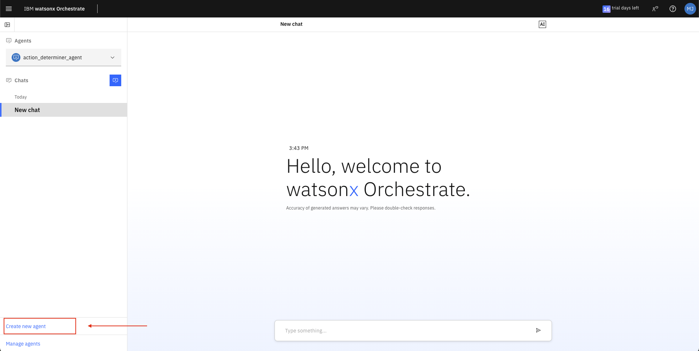

- Select the following:
    - **Create from scratch**
    - Name: **Vehicle maintenance Agent**
    - Description: **A helpful and knowledgeable vehicle troubleshooting assistant.**

- Create the agent.

    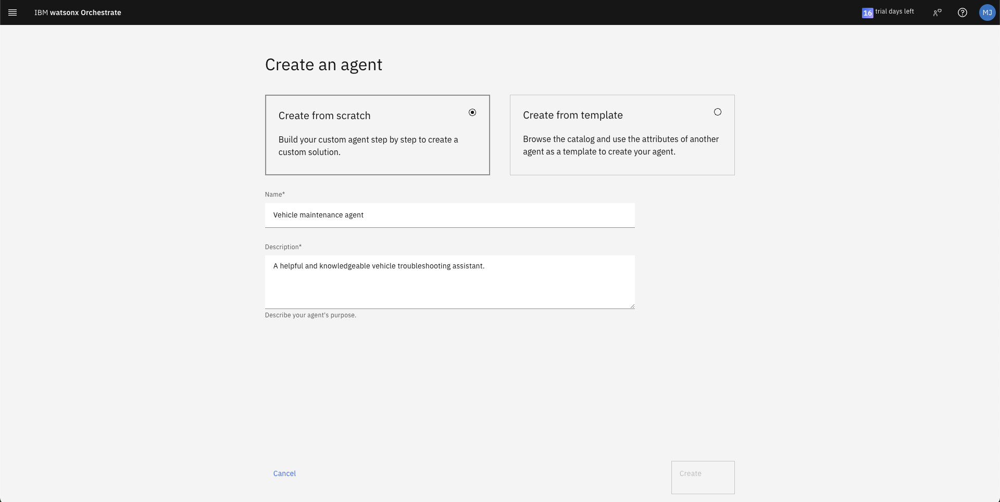

### 3. Configure the agent

- The agent will have 4 sections:
    - **Profile**: Describes your agent's purpose.
    - **Knowledge**: Provides the specific knowledge your agent needs to accomplish its goal. (RAG)
    - **Toolset**: Add tools and other agents to help your agent take action.
        - **Tools**: Gives your agent access to your organization's tool to help it accomplish tasks.
        - **Agents**: Identifies agents to whom your agent can delegate tasks.
    - **Behavior**: Defines how and where your agent should react to requests and respond to users. (System Prompt)

#### Profile

- This is the description of your agent, which you have already defined.

    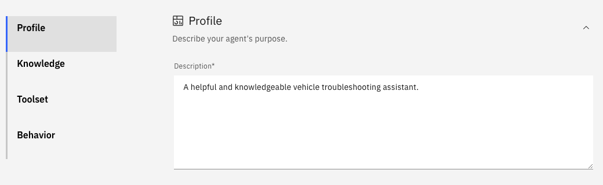

#### Knowledge

- This is the additional context that you can provide to your agent for Retrieval Augmented Generation (RAG).

    !!! success "Note"

        Every agent developed on watsonx Orchestrate will support Retrieval Augmented Generation (RAG) out of the box!

- For the Vehicle maintenance agent, we'll upload some documents such as vehicle's user manual and diagnostic trouble codes (DTC). We have selected publicly available data such as Jeep Compass user manual and DTC codes list.

- Add a description and upload the files from the downloaded `knowledge_bases/` directory:

    - Description: **This knowledge addresses the car manual, dtc codes related information to the Jeep Compass 2024.**
    - Upload files from the downloaded files `knowledge_bases/` directory: 
        - **Jeep-Compass-OM-24.pdf**
        - **dtc_list.pdf**

    !!! info

        You can also connect to external repository to add knowledge base. Currently supported external repositories are:
        
        - Milvus
        - Elastic search

    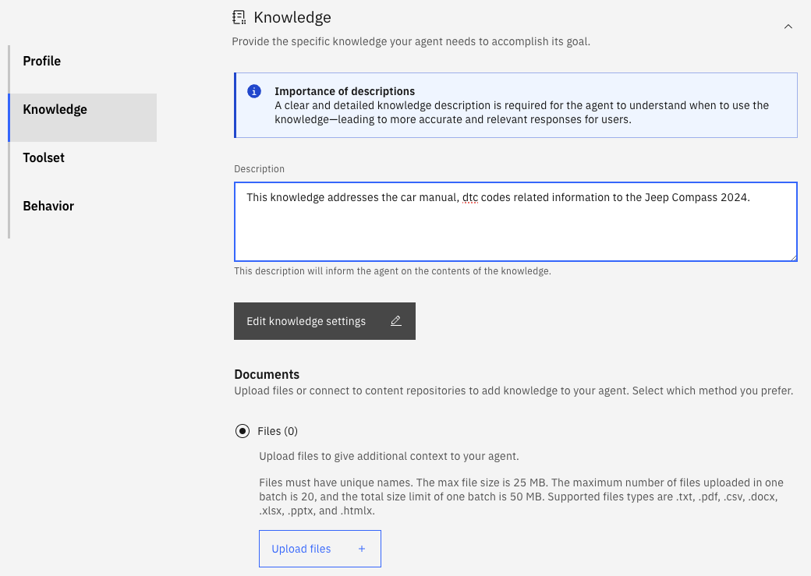

#### Toolset

!!! note

    We deployed the custom tools and agents as a pre-requisite step earlier in the lab guide. We'll use the same in the Agent Builder.

##### Tools

- You can add tools from any of the following methods:
    1. Add from catalog: Choose from a catalog of existing tools.
    1. Add from local instance: Choose from a lost of tools available on this instance.
    1. Import: Import an external tool.
    1. Create a new flow: Use the tool builder to create a sequence of steps.

- We will be using the **Add from local instance**. Click on **Add tool** and select **Add from local instance**.

- Select the tool:
    - **get_nearest_service_center**

##### Agents

- You can add a new agent from any of the following methods:
    1. Add from catalog: Choose from a catalog of pre-built agents.
    1. Add from local instance: Choose from a list of agents available on this instance.
    1. Import: Import and register an external agent.

- We will be using the **Add from local instance**. Click on **Add agent** and select **Add from local instance**.

- Select the agent:
    - **vehicle_telematics_agent**

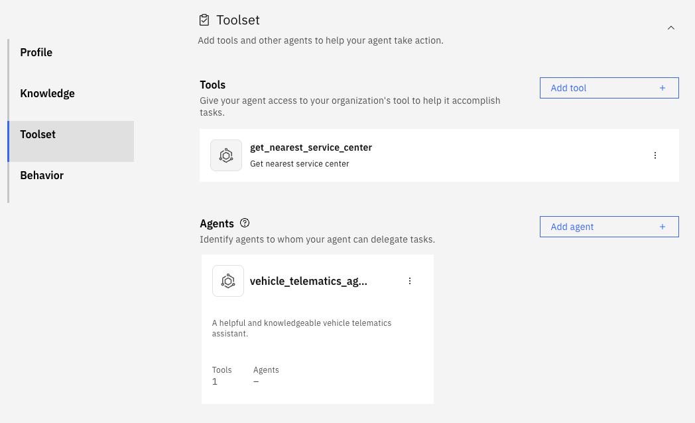

#### Behavior

- Add the following system prompt:

```
You are an expert Vehicle maintenance assistant. Your job is to help car owners diagnose and understand vehicle issues by analyzing telematics data and referring to the official user manual. VIN Number: 1HGBH41JXMN109186

  Your Tasks:

  1. **Analyze Telematics Data** - Use Vehicle Telematics Agent
    - Extract insights from:
      - `engine_temp`: Flag overheating if temperature exceeds normal range.
      - `battery_voltage`: Identify low or irregular voltage patterns.
      - `dtc_codes`: Decode Diagnostic Trouble Codes using the DTC codes manual.
      - `odometer_km` & `last_service_km`: Check if service is overdue (interval: 15,000 km).  
        If overdue, inform the user with:
        - Current odometer reading
        - Kilometers overdue

  2. **Consult the Vehicle Manual**
    - Refer to the car user manual for servicing the car related details

  3. **Explain Clearly**
    - Structure your response in **markdown format**.
    - Use a tone that is:
      - **Technically sound** for experienced drivers
      - **Easy to understand** for novice drivers
    - Keep the explanation helpful, informative, and action-oriented.

  ---

  ### Output Format:

  ````markdown
  ## Vehicle Health Report

  ### Diagnostic Trouble Codes (DTC)
  - **PXXXX** - [Meaning from DTC manual]  
    _Recommended Action: [Steps from car manual]_

  ### Engine Temperature
  - Current Temp: XX°C  
    _[Normal/Overheating]_ - [Explanation and suggestions]

  ### Battery Voltage
  - Voltage: XX.XV  
    _[Normal/Low]_ - [Explanation and actions if needed]

  ### Service Status
  - Odometer: XX,XXX km  
  - Last Service: XX,XXX km  
  - **[Service Due / Not Due]**
    - _Service is due after 15,000 km. Please schedule maintenance._

  ---

  ### Manual Insights
  [Summarized relevant information from the vehicle manual]

  ---

  ### Recommendations
  - [Prioritized action list]
  ````
```

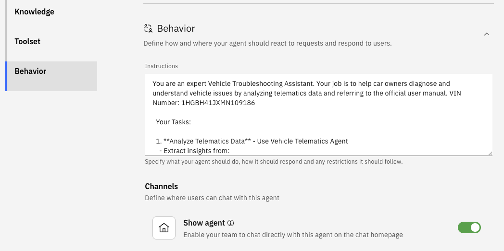

### 4. Deploy the agent

- Click on the top right **Deploy** button to make the agent live.
    
    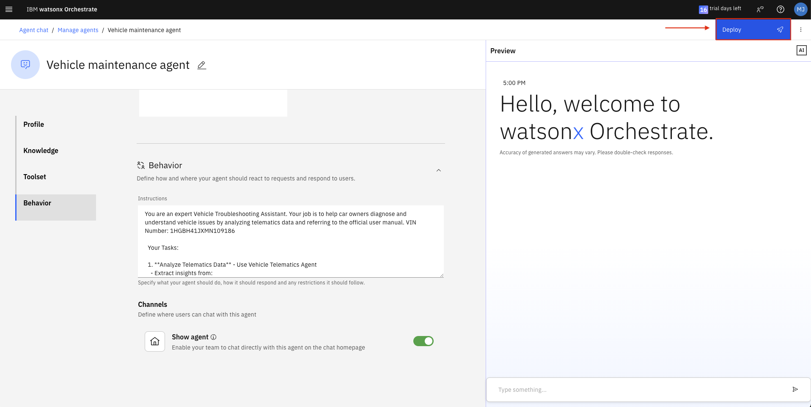

### 5. Test the agent

- Go to the **Agent chat** page.

- Select the **Vehicle maintenance agent**.

    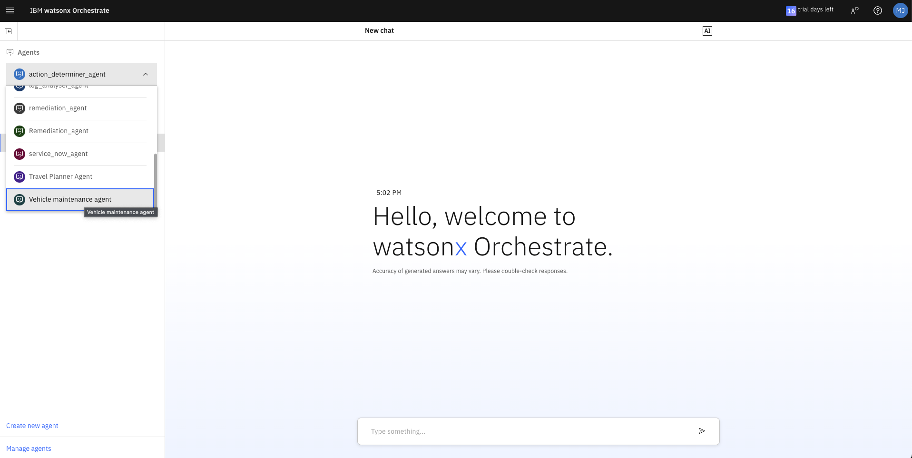

- Now you can chat with the agent with the suggested script below.

## Suggested script

1. **What does the engine temperature warning light mean?** -> Troubleshoot agent will use the Knowledge base to RAG and answer this query

    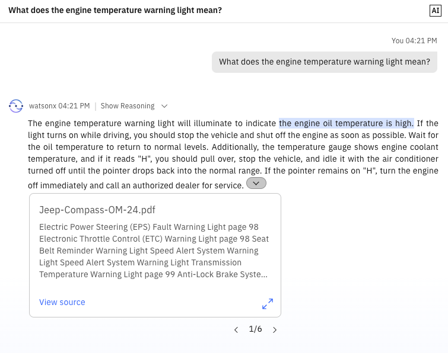

2. **Help me diagnose my car. It is shaking and I have the engine temperature warning light on.** -> Troubleshoot agent will transfer the control to Telematics data analyzer agent which will ask follow-up questions if required and give a car health report. The car report is read, and a suggestion is provided by the Troubleshoot agent.

    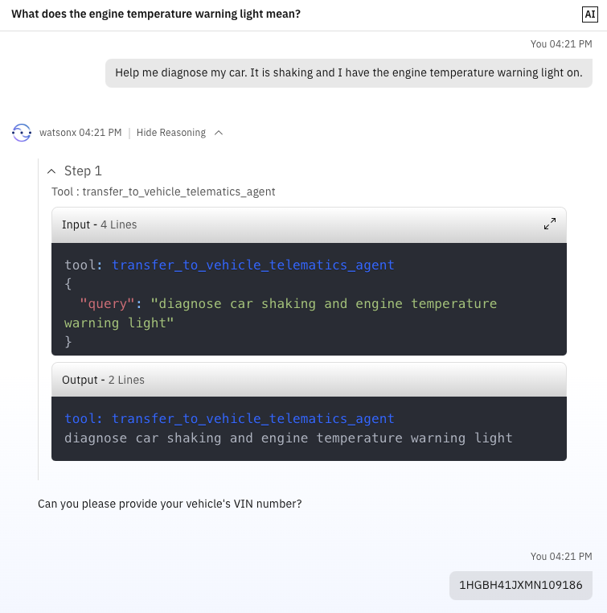
    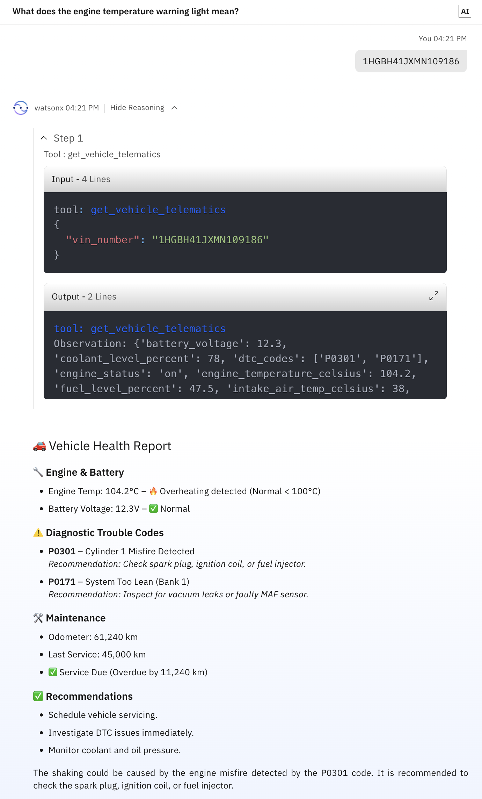

3. **Where is the nearest service center?** -> Troubleshoot agent will invoke the Get nearest service center tool and pass the lat & long received from the Telematics data analyzer agent (assumption is that car will send the current lat & long data as part of telematics data.) and get the nearest service centers from the list of service centers.

    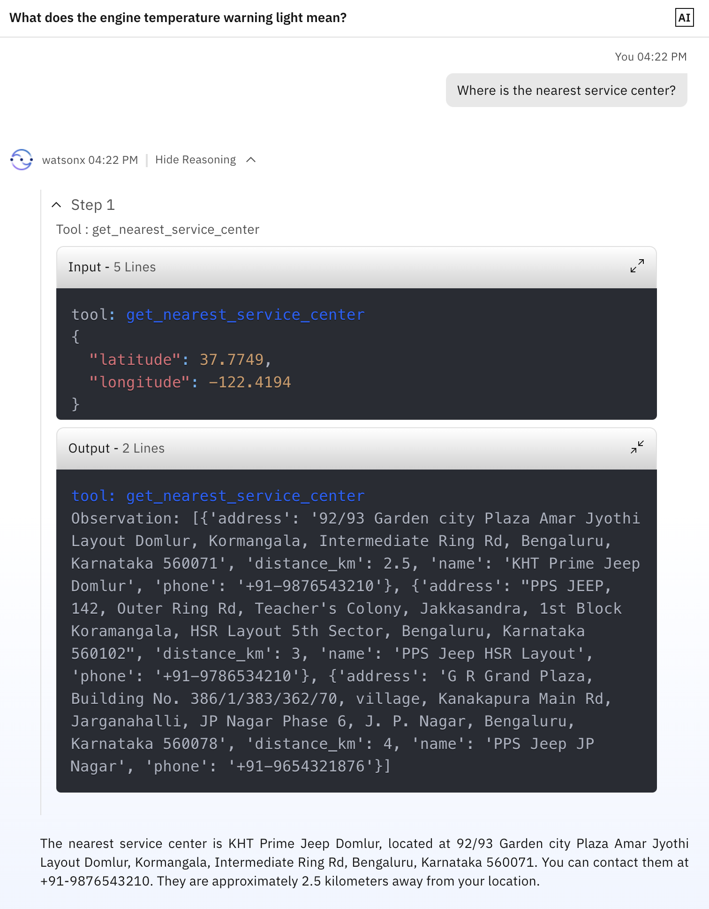
