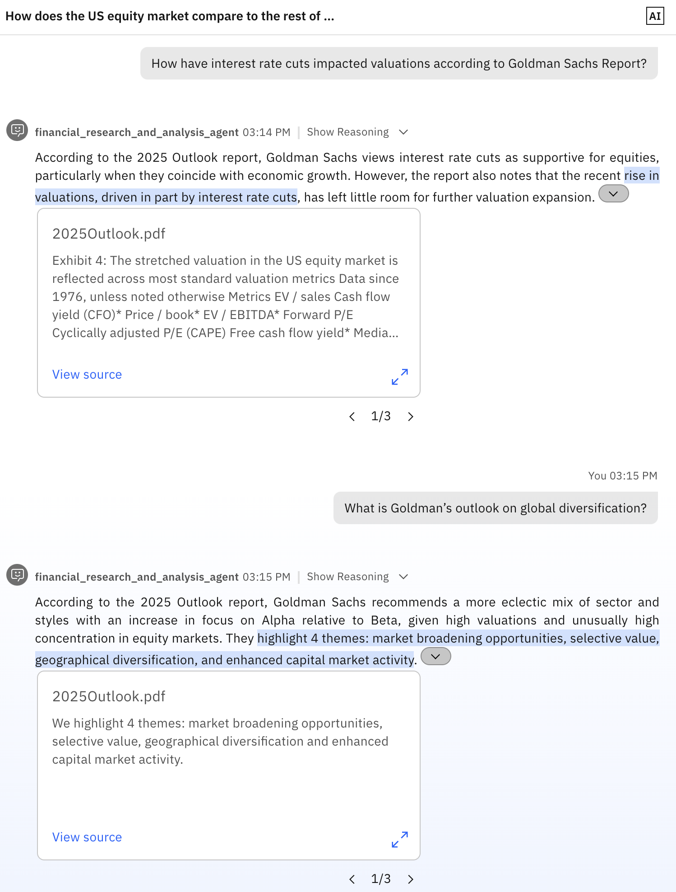

# Lab guide for financial research and analysis

## Overview

A financial advisor must go through various data points before meeting a client for financial advisory. The financial advisor must spend time after the meeting with the client to summarize the key decisions that were suggested during the meeting. The financial research and analysis lab focusses on various Gen AI use cases such as retrieval augmented generation, SQL retrieval, web search, summarization and text generation that will help boost the productivity of the financial advisor.

## Pre-requisites

- Make sure you've already setup the environment:
- [Lab 0 - Environment setup](../../../../labs/env-setup-lab/)
- [ADK Installation](https://developer.watson-orchestrate.ibm.com/getting_started/installing){:target="_blank"}
- [Download files](https://ibm.box.com/s/n0pkqfjzwxi3cvzaq8msaclfnf7mbwro){:target="_blank"}
- Download the **financial_research_and_analysis_agent.zip** file from Lab2 folder.

## Reference Architecture


## Key Components

- Risk assessment agent (External LangGraph Agent) – An agent running in a custom langchain container capable of communicating with external news sources to combat disinformation.
- Report generator agent (Collaborator Agent) – An agent capable of generating stock investment portfolio reports by retrieving user portfolios and summarizing relevant articles.
- Financial research and analysis agent (Supervisor Agent) - An agent capable of providing financial insights, generating stock investment reports, and assisting with meeting follow-ups.
- Portfolio retriever (Tool) – Get client's portfolio from database.
- Transcript retriever (Tool) – Get client's meeting transcripts from database.
- Web search (Tool) - Search the web for relevant information.
- Goldman Sachs 2025 outlook (Knowledge base) - This knowledge addresses the goldman sachs 2025 outlook.

## Steps

Make sure you have downloaded the required files for the lab and extracted it. Go to the root of the downloaded directory.
```
cd financial_research_and_analysis_agent/
```

You should see the following directories & files listed:
```
├── agents
│   ├── agent.yaml
│   └── report_generator_agent.yaml
├── cleanup.sh
├── collaborators
│   ├── external-agent-source-code.zip
│   └── external-agent.yaml
├── knowledge_bases
│   ├── 2025Outlook.pdf
│   └── knowledge.yaml
├── README.md
├── setup.sh
└── tools
    ├── portfolio_retriever_tool
    │   ├── portfolio_retriever.py
    │   └── requirements.txt
    ├── transcript_retriever_tool
    │   ├── requirements.txt
    │   └── transcript_retriever.py
    └── web_search_tool
        ├── requirements.txt
        └── web_search.py

8 directories, 15 files
```

### 1. Deploy the tools

#### Portfolio retriever tool & Transcript retriever tool

- Deploy the **portfolio_retriever_tool** and **transcript_retriever_tool** directly by running the following commands:
    ```
    orchestrate tools import -k python -f "tools/portfolio_retriever_tool/portfolio_retriever.py" -r "tools/portfolio_retriever_tool/requirements.txt"
    ```

    ```
    orchestrate tools import -k python -f "tools/transcript_retriever_tool/transcript_retriever.py" -r "tools/transcript_retriever_tool/requirements.txt"
    ```

#### Web search tool

We have integrated the [Tavily](https://www.tavily.com/){:target="_blank"} search API to implement the web search tool within our watsonx Orchestrate. Tavily is a third-party AI-powered search service designed to deliver accurate, real-time information by querying the web and returning concise, relevant results. This integration demonstrates how external APIs can be seamlessly incorporated into watsonx Orchestrate to enhance agent capabilities with dynamic and up-to-date knowledge retrieval from the internet.

!!! example "Tavily API Key"

    To use the Tavily search APIs you need to create an API Key. **Sign-up for free researcher plan that is meant for creators which provides 1,000 API credits / month here**: [https://app.tavily.com/home](https://app.tavily.com/home){:target="_blank"}

!!! danger "Cache instead of Tavily"

    If you don't wish to sign-up for Tavily search you can use the cached version by setting the `USE_CACHED_RESPONSES=True` in the `tools/web_search_tool/web_search.py`

- Create a connection with watsonx Orchestrate.
    ```bash
    orchestrate connections add -a tavily
    ```

    ```bash
    orchestrate connections configure --app-id tavily --environment draft -t team -k key_value
    ```

    ```bash
    orchestrate connections set-credentials --app-id=tavily --env draft -e TAVILY_API_KEY=<your_api_key>
    ```

- Deploy the tool.
    ```bash
    orchestrate tools import -k python -f "tools/web_search_tool/web_search.py" -r "tools/web_search_tool/requirements.txt" --app-id tavily
    ```

At this point you have successfully deployed all the required tools.

### 2. Deploy the knowledge base

We are using a subset of Goldman Sach's 2025 outlook report as a knowledge for the financial research and analysis agent. Run the following command to deploy the knowledge base:
```bash
orchestrate knowledge-bases import -f knowledge_bases/knowledge.yaml
```

At this point you have successfully deployed all the knowledge bases.

### 3. Deploy the external agent

We have developed a Risk Assessment Agent using LangGraph and integrated it as an external collaborator within watsonx Orchestrate. This implementation demonstrates how open-source agent frameworks can interoperate seamlessly with watsonx Orchestrate native agents, enabling flexible, modular, and extensible agent collaboration across platforms.

??? tip "INSTRUCTORS TO SETUP THE EXTERNAL AGENT!"

    Instructors need to setup the external agent before demonstrating this feature.

    **Pre-requisites**:
    
    1. watsonx.ai API Key & Space ID.
    1. Generate a new task credential API key <https://dataplatform.cloud.ibm.com/settings/user-api-key?context=wx>
    1. Tavily API Key. [https://app.tavily.com/home](https://app.tavily.com/home){:target="_blank"}
    
    **Steps to deploy the external agent**:

    1. Download and extract the [external-agent-source-code.zip](https://ibm.box.com/s/vwajivchbjs0hsm4u54m9vriqwtui8s8){:target="_blank"} file.
    1. Add your IBM watsonx.ai API Key, Space ID and project ID in the `config.toml` file.
    1. Add your tavily API key in the following file `external-agent-source-code/src/risk_assessment_agent/tools.py` Line no: 15.
    1. Deploy the external agent on watsonx.ai runtime by running the following commands:
        ```bash
        cd external-agent-source-code/
        ```
        ```bash
        pip install ibm-watsonx-ai-cli
        ```
        ```bash
        watsonx-ai service new
        ```
    1. At this point you should have a deployment ID something like this: `a5972a7-1a9f-4ef6-b938-6bb4d4f03508`.
    1. Your final deployed service endpoint will be: `https://{REGION}.ml.cloud.ibm.com/ml/v4/deployments/{DEPLOYMENT_ID}/ai_service_stream?version=2021-05-01`

        !!! success "Instructors to share the deployed service endpoint with the participants"

            - Share the final deployment service endpoint to the participants for the next steps. The URL will look something like this - 
            
            **https://us-south.ml.cloud.ibm.com/ml/v4/deployments/8a5972a7-1a9f-4ef6-b938-6bb4d4f03508/ai_service_stream?version=2021-05-01**.

            - You will also need to share your API Key, you can create an API Key and only scope it to watsonx.ai runtime so that the participants cannot access any other resources from your TechZone instance.
        
        !!! danger "Rotate your API Key after every Bootcamp!"

            Since you shared the API Key with participants, it must be rotated after the bootcamp.

    **Troubleshooting:**

    1. Incase you run into any issues refer the official IBM Developer Hub documentation to learn how to deploy agents on watsonx.ai runtime. <https://www.ibm.com/watsonx/developer/agents/quickstart>


???+ abstract "Patch the `external_agent.yaml` with deployment ID"
     
    - Open the `financial_research_and_analysis_agent/collaborators/external_agents.yaml`.
    - Enter the `api_url` on line no: 11.
    - Enter your `watsonx_api key` on line no: 14.
    - Save the file.

    !!! note "API URL and API KEY"

        The API URL and API KEY will be provided by the instructors.

Now that you have obtained the deployed api url from instructor and patched the external_agent.yaml file, navigate back to the root directory `financial_research_and_analysis_agent` and run the following commands to deploy the agent on watsonx Orchestrate.

```bash
orchestrate agents import -f collaborators/external_agent.yaml
```

At this point, the external agents are deployed to watsonx Orchestrate.

### 4. Deploy supervisor and collaborative agents

Finally, deploy the Financial research and analysis agent and the Report generator agent by running the following commands:

```bash
orchestrate agents import -f agents/report_generator_agent.yaml
```

```bash
orchestrate agents import -f agents/agent.yaml
```

At this point, all the required agents and tools are deployed on watsonx Orchestrate and ready to use.

Now you can chat with the agent with the suggested script below.

### Suggested script

Select the `financial_research_and_analysis_agent`.

1. **Generate a portfolio report on John Doe's securities** -> The financial research and analysis agent will perform the following tasks to get the report:
    - Get the portfolio of John Doe from a SQL database.
    - Transfer the control to the Report generator agent.
    - The report generator agent will search each of the security performance on web using web search tool.
    - The report generator agent will summarize everything and generate a report.

        

2. **Perform a risk assessment on the securities** -> The financial research and analysis agent will perform the following tasks to get the risk assessment report:
    - Transfer the control to the external risk assessment agent with the securities.
    - The external risk assessment agent will perform the risk assessment with its business logic and return the report.

        

        !!! bug "Bug"

            Currently the transfer back from external agent to supervisor is not happening, this is a known bug and the product team is working on fixing it! 
            
            - **Kindly start a new chat after asking the above question.**

3. **Summarize recent meeting with John Doe and generate an email with minutes of meeting** -> The financial research and analysis agent will perform the following tasks to generate email:
    - Get the transcript of John Doe's meeting from Object Storage.
    - Summarize it and create an email.

        

4. **How have interest rate cuts impacted valuations according to Goldman Sachs Report?** or **What is Goldman’s outlook on global diversification?** -> The financial research and analysis agent will retrieve the information from the Goldman Sachs 2025 outlook report (RAG) to answer these queries.

    

5. **How does the US equity market compare to the rest of world?** -> The financial research and analysis agent will perform the following tasks to give the financial insights:
    - Use the Tavily search to get the results
    > Note: If you have not set the Tavily API key then this won't work

    

!!! success "Conclusion"

    👏 Congratulations on completing the lab! 🎉
