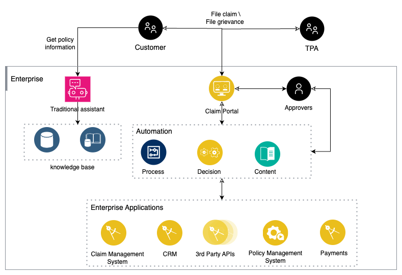
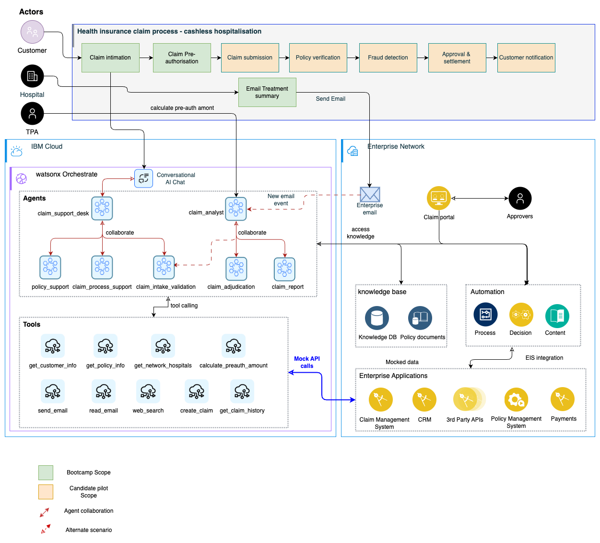
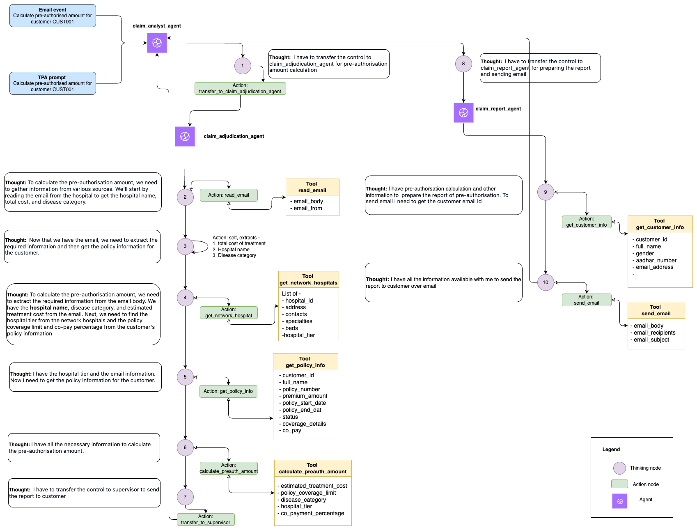

This use case demonstrates the deployment of AI Agents to enhance the cashless hospitalization experience by streamlining both customer interaction and backend claim processing.

At the hospital front desk, an AI-powered virtual agent acts as the first point of contact, delivering efficient and personalized support for insurance-related queries. It provides human-like responses, helping customers understand their policy coverage and guiding them seamlessly through the claim initiation process.

Simultaneously, a background AI claim analyst agent is triggered to proactively evaluate the claim, verify policy entitlements, and calculate the pre-authorized amount based on policy rules and treatment details. Once reviewed, it automatically notifies the customer via email with the approval status and next steps.

In certain scenarios, this claim analyst agent can also be manually triggered by a TPA desk agent

Here's your **Problem Statement** rewritten in clean and structured **Markdown format**:

---

## 🧾 **The Problem**

The traditional cashless hospitalization process in insurance involves multiple **manual steps or traditional assistant flow**—including front desk coordination, claim intake, document validation, and pre-authorization. These manual processes are:

* ⏱️ **Time-consuming**
* ⚠️ **Prone to human error**
* 🏥 **Delay critical treatment**
* 😟 **Cause poor customer experience**

As a result, **hospitals, insurers, and patients** face significant friction due to:

* 🔁 **Inefficient coordination** between hospital front desk staff and insurance providers
* 📄 **Manual verification** of patient policy eligibility and supporting documents
* ⌛ **Delayed pre-authorization approvals** caused by backlogs and manual checks
* 💸 **High operational costs** from repetitive, rule-based tasks performed by human agents

### **As-Is Architecture**
 

---

## 🎯 **Objective**

The objective is to design an **Agentic AI solution** that automates and streamlines the **end-to-end cashless hospitalization claim process**, delivering faster turnaround, improved customer experience, and operational efficiency.

### ✅ **Key Highlights**

---

### 🤖 **1. Front Desk AI Agent for Customer Support & Collaboration**

* Deploy an **AI-powered Front Desk Agent** to serve as the primary interface to the customer.
* This agent delivers **human-like, real-time support** for customer queries related to policy details, claim process, and documentation.
* It actively **collaborates with other specialized AI agents**, such as those responsible for **claim intake and document verification**, to ensure a smooth and accurate initiation of the claim process.

### 🤖 **2. Claim Analyst AI Agent for Proactive Claim Processing**

* Implement a **Claim Analyst AI Agent** that works **proactively in the background**.
* This agent collaborates with claim adjudication and report agents to:

    * Calculate the pre-authorized claim amount
    * Generate a detailed report
* Once processed, it **automatically notifies the customer via email**, ensuring transparency and speed.

### 🛠️ **3. Intelligent Access to Enterprise Systems**

* Provide AI agents with **secure and intelligent access** to relevant enterprise systems and data repositories.
* Enables agents to **fetch contextual information in real time**, supporting more accurate decision-making and faster response times.

---

## 🚀 **Business values**

1. **Faster, smoother interactions** boost first-contact resolution and customer trust.
2. **Resolving multiple issues in one chat** cuts handling time and costs.
3. **Accurate, complete responses** reduce errors and improve satisfaction.
4. **Easy-to-understand insurance/claims info** improves customer experience.
5. **Location-based help (hospitals/doctors)** adds convenience and empathy.
6. **Auto pre-authorization** speeds up approvals and reduces manual work.
7. **No more manual document uploads** means fewer frustrations and faster claims.

---

 ## **To-Be Architecture**

### **AI Agents working model**

The diagram below demonstrates the AI agent's reasoning capabilities in processing insurance claims for pre-authorization amount

---

## **Step-by-step Hands-on Instructions**

---

You can find step-by-step instructions in this document. It shows how you can implement the use case using watsonx.ai and watsonx Orchestrate.

---

## **Demo video**

---
[ICP_Pre_Hosp_Demo.mp4](../../videos/ICP_Pre_Hosp_Demo.mp4)