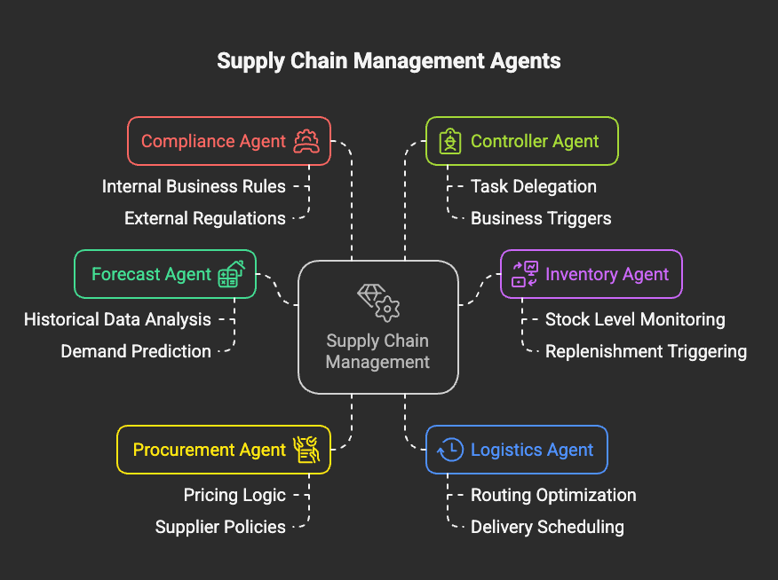

# Supply chain use case

This use case demonstrates how AI-powered agents can streamline end-to-end supply chain operations by handling domain-specific tasks and collaborating autonomously to achieve operational efficiency and business continuity.

At the planning stage, the **Forecast Agent** estimates product demand trends using historical data. This drives informed decisions for stock replenishment and production.

Simultaneously, the **Inventory Agent** evaluates stock levels, identifying shortages or surpluses and triggering replenishment tasks if needed. If new materials are required, the **Procurement Agent** negotiates purchases based on pricing logic and supplier policies.

The **Logistics Agent** handles routing and delivery schedules, ensuring cost-effective and timely distribution. Throughout this process, the **Compliance Agent** ensures all actions align with internal business rules and external regulations.

The **Controller Agent** serves as the central decision-maker, dynamically delegating tasks across agents based on the user's query or business trigger.

---

## 🧾 **The Problem**

Traditional supply chain workflows are highly siloed, manual, and sequential. This leads to:

* ⏱️ **Slow response times** when demand changes
* ⚠️ **Missed cost-saving opportunities** due to poor procurement coordination
* 🚚 **Inefficient routing and logistics delays**
* 📉 **High overhead in compliance reporting**

As a result, enterprises face:

* 🔄 **Disconnected planning across departments**
* 🧾 **Manual reviews for every adjustment or policy check**
* 💸 **Operational costs due to rework and poor visibility**

### **As-Is Architecture**

---

## 🎯 **Objective**

To build an agentic AI-based supply chain automation system that improves:

- Speed of response to demand or risk
- Planning and execution accuracy
- Collaboration across stakeholders
- Scalability of operations with minimal human effort

### ✅ **Key Highlights**

### 🤖 1. Forecast Agent
- Predicts future demand trends using historical data
- Drives smarter procurement and production

### 📦 2. Inventory Agent
- Continuously monitors stock levels
- Raises restock alerts or triggers orders automatically

### 📥 3. Procurement Agent
- Finds optimal vendors and initiates purchase orders
- Supports dynamic price and volume negotiation logic

### 🚛 4. Logistics Agent
- Plans distribution schedules and delivery routes
- Simulates estimated arrival times

### ✅ 5. Compliance Agent
- Checks if each action complies with internal/external policy
- Prevents policy violations proactively

---

## 🚀 **Business Value**

1. **Automated coordination** reduces email and task follow-ups
2. **Demand-aware procurement** minimizes waste and improves margins
3. **Faster shipping cycles** improve customer satisfaction
4. **Built-in compliance** simplifies audits and reduces risk
5. **Centralized controller agent** boosts agent synergy and efficiency

---

## 🧠 **Agent Collaboration Model**

The diagram below shows how agents collaborate to handle a supply chain query, such as:

"Fulfill an order of 500 units of Product A"

1. Forecast Agent evaluates demand.
2. Inventory Agent checks current stock.
3. Procurement Agent raises PO if needed.
4. Logistics Agent simulates delivery.
5. Compliance Agent ensures all steps meet policies.

---

## Step-by-Step Hands-on Instructions

Follow the lab guide to build this system: [📘 Lab Guide](lab-guide.md)

---

## 🎥 Demo Video

Watch a walkthrough of this solution in action: [Supply Chain Agent Demo](https://ibm.ent.box.com/file/1867459705753)

